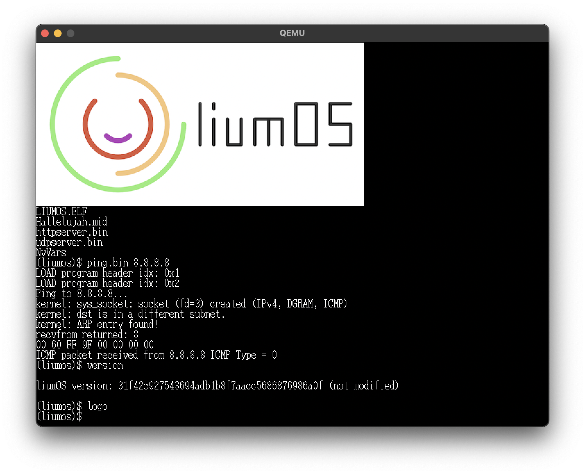

# liumOS


[](https://circleci.com/gh/hikalium/liumos)
[](https://opensource.org/licenses/MIT)




A toy operating system which supports NVDIMM natively.

## Requirements

### Common

[Install Rust toolchain](https://www.rust-lang.org/tools/install)

Check the installation (below is an example output):
```
$ cargo --version
cargo 1.46.0 (149022b1d 2020-07-17)
```

Then, install nightly toolchain and cargo-xbuild for cross compiling.

```
rustup toolchain install nightly-x86_64-unknown-linux-gnu
rustup component add rust-src
```

### macOS

```
brew install wget cmake qemu llvm dosfstools
```

### Ubuntu 20.04

```
sudo apt install wget cmake qemu-system-x86 clang-8 lld-8 libc++-8-dev libc++abi-8-dev clang-format
```

## Prepare tools and libraries

Move to the root of this source tree. Then:

```
make tools
make prebuilt
```

## How to build

```
make
```

## Run on QEMU

This repository contains [OVMF](https://github.com/tianocore/tianocore.github.io/wiki/OVMF) binary for UEFI emulation.

```
make run
```

You can connect serial console using telnet

```
telnet localhost 1235
```

## Setup tap interface (for linux)

`make run` boots liumOS on QEMU with a tap interface on Linux host.
To avoid running QEMU with sudo, you need to setup a tap interface in advance.

```
sudo ip tuntap add dev tap0 mode tap user $USER
sudo ip link set dev tap0 master br0
sudo ip link set dev tap0 up
```

example output with bridge `br0` connected to `eno1`
```
$ ip a | grep -e br0 -e tap0
2: eno1: <BROADCAST,MULTICAST,UP,LOWER_UP> mtu 1500 qdisc mq master br0 state UP group default qlen 1000
4: br0: <BROADCAST,MULTICAST,UP,LOWER_UP> mtu 1500 qdisc noqueue state UP group default qlen 1000
    inet 10.10.10.93/24 brd 10.10.10.255 scope global dynamic br0
6: tap0: <BROADCAST,MULTICAST,UP,LOWER_UP> mtu 1500 qdisc fq_codel master br0 state UP group default qlen 1000
```

### Setup bridge interface

#### global, persistent
```
network:
  ethernets:
    eno1:
      dhcp4: false
      dhcp6: false
  bridges:
    br0:
      interfaces: [ eno1 ]
      dhcp4: true
  version: 2
```

## References
- [newlib](https://sourceware.org/newlib/)
- [llvm](https://llvm.org/)
- [tianocore/edk2](https://github.com/tianocore/edk2)
- [cupnes/x86_64_jisaku_os_samples](https://github.com/cupnes/x86_64_jisaku_os_samples)
- [yoppeh/efi-clang](https://github.com/yoppeh/efi-clang)

## Author
[hikalium](https://github.com/hikalium)
